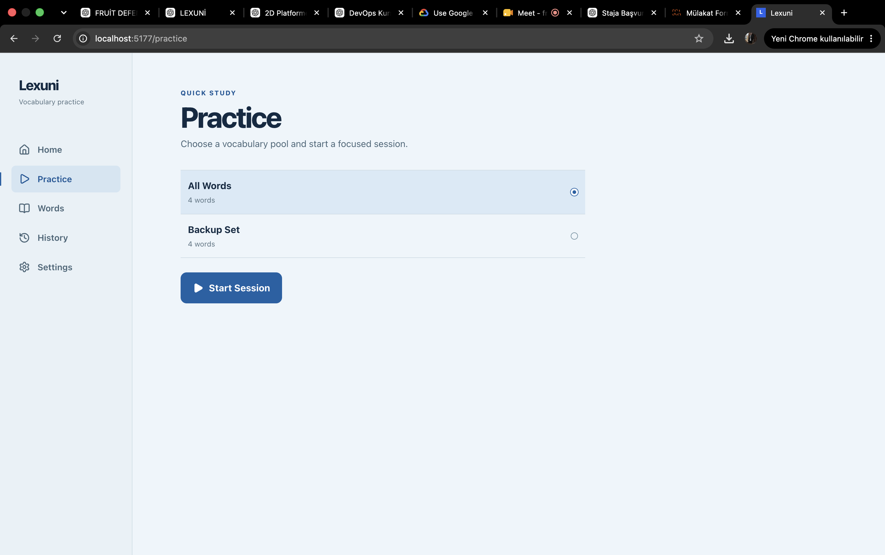
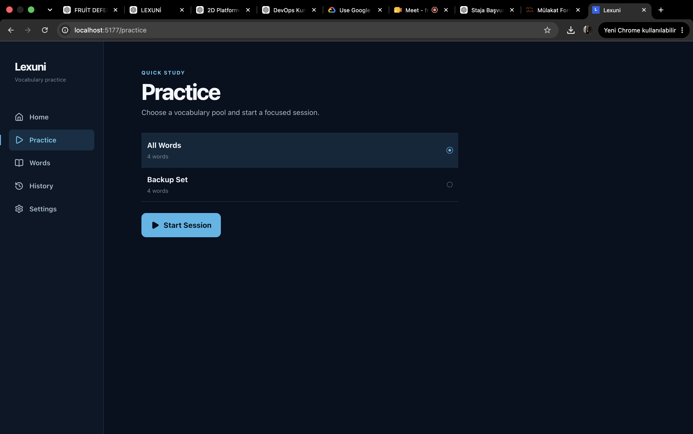
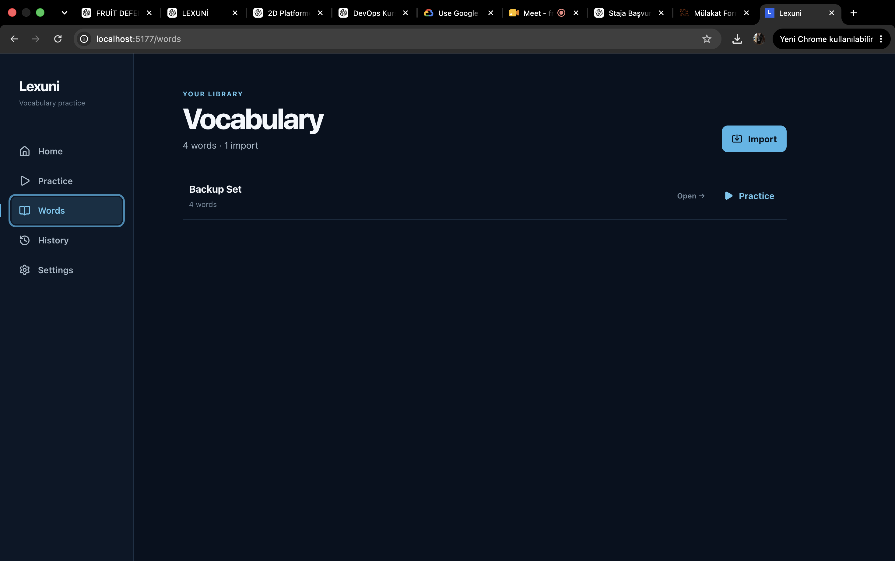
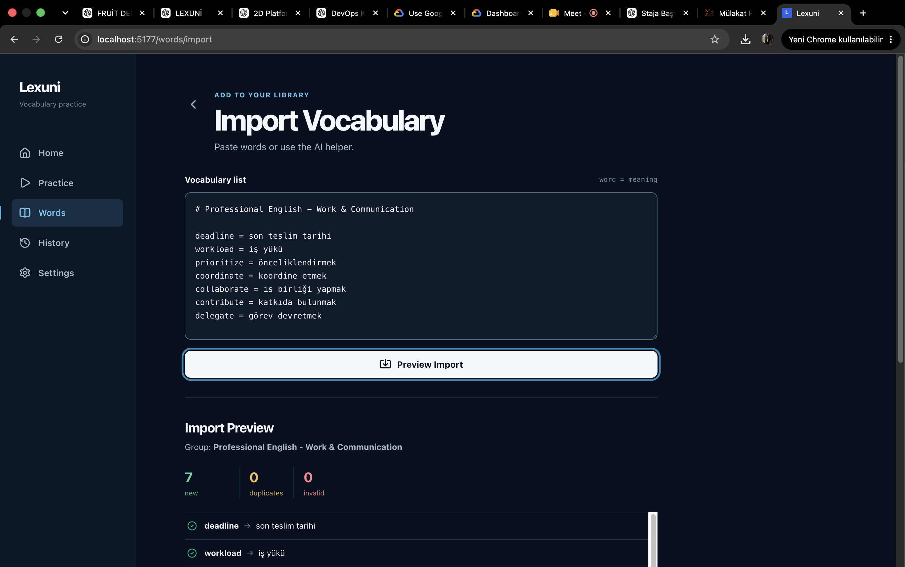

# Lexuni

**Lexuni is a local-first vocabulary trainer for learning the English words you actually care about.**

## Overview

Traditional language apps often spend time on words you already know. Lexuni lets you import your own English–Turkish vocabulary and practice only that personal vocabulary pool. It runs entirely in the browser and requires no account or backend.

## Screenshots

<p align="center">
  
  
</p>
<p align="center"><sub>Practice — Arctic and Midnight</sub></p>

<p align="center">
  
  
</p>
<p align="center"><sub>Vocabulary library and import preview</sub></p>

## Features

- Import custom vocabulary with a simple, human-readable text format.
- Keep import batches organized as groups, with rename and merge tools.
- Practice a single group or the complete **All Words** pool.
- Alternate between English → Turkish and Turkish → English questions.
- Answer four-choice questions with immediate correction and later reinforcement.
- Get balanced coverage through a shuffle-bag question queue.
- Resume unfinished study sessions after navigation or reloads.
- Review session history, mistakes, and per-word statistics.
- Choose from six themes, led by Arctic and Midnight.
- Store vocabulary and progress locally in IndexedDB.
- Export and restore a full local JSON backup.
- Install Lexuni as a Progressive Web App (PWA).

## Import Format

```text
# Google Cloud

deploy = yayına almak
reliable = güvenilir
credential = kimlik bilgisi
```

A line beginning with `#` names the import group. Each vocabulary entry uses `english = Turkish`; `:` and `-` are also accepted as separators.

## Local-first Privacy

Lexuni stores vocabulary, groups, sessions, and history in IndexedDB on your device. No account or backend is required for core use, and vocabulary is not automatically uploaded to a server. Backup and export actions are initiated and controlled by you.

Because browser storage can be cleared, export a full backup periodically if your vocabulary matters to you.

## Tech Stack

- React 19
- TypeScript
- Vite
- Tailwind CSS
- Dexie / IndexedDB
- `vite-plugin-pwa`

## Getting Started

Node.js 22.12 or newer is required. Node 24 is used for development and CI.

```bash
git clone https://github.com/bektasing/lexuni.git
cd lexuni
npm ci
npm run dev
```

Open the local URL printed by Vite.

## Quality Checks

```bash
npm run lint
npm run build
```

To preview the production build locally:

```bash
npm run preview
```

## Project Structure

- `src/components/` — shared navigation, modal, and confirmation UI
- `src/pages/` — application screens and practice flow
- `src/db/` — Dexie database definition and migrations
- `src/lib/` — theme and practice-feedback helpers
- `src/types/` — persisted data types
- `public/` — PWA assets

## Contributing

Contributions are welcome. See [CONTRIBUTING.md](CONTRIBUTING.md) for the development workflow and data-safety expectations.

## Developer

Created by [Hamza Bektaş](https://hamzabektas.xyz).

## License

Lexuni is available under the [MIT License](LICENSE).
